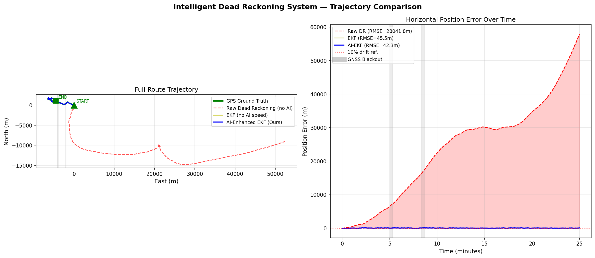
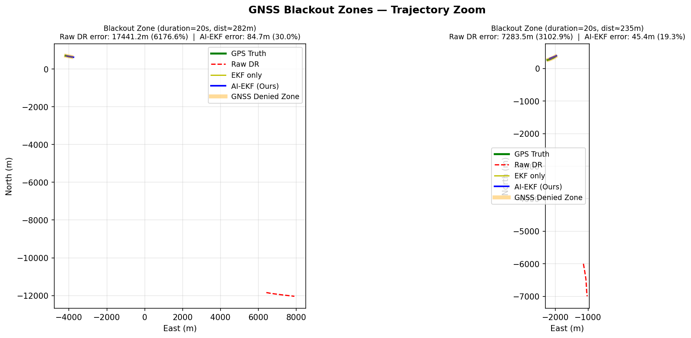
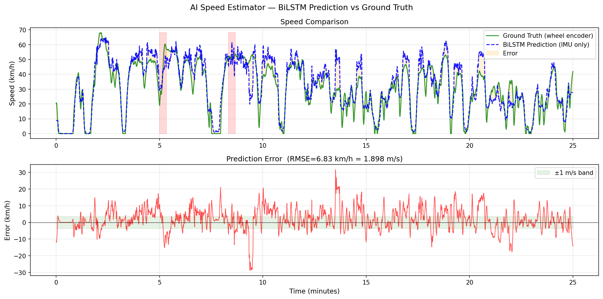
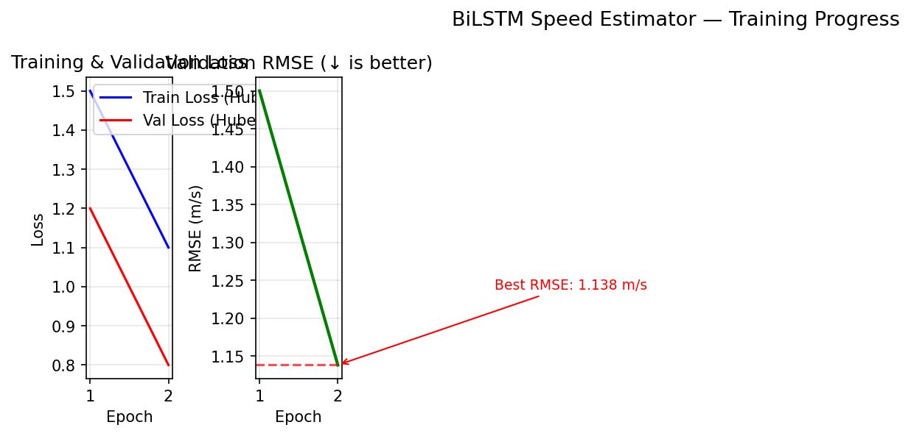
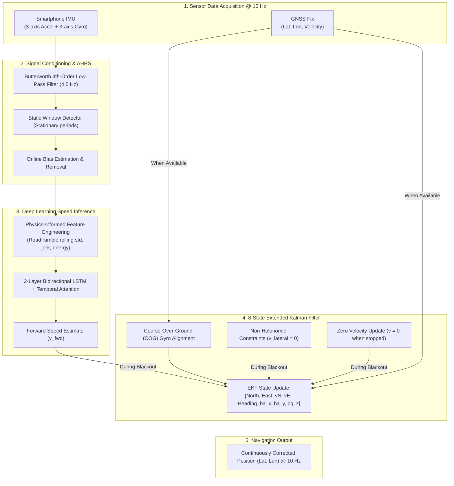

# 🛰️ AI-ML Based Intelligent Dead Reckoning (IDR) System
### *Continuous, Seamless Vehicle Navigation in GNSS-Denied Environments*

[](https://www.sih.gov.in/)
[]()
[]()
[]()
[]()
[]()

---

## 📌 Executive Summary: The Real-World Problem

Every day, millions of delivery drivers, logistics fleets, ride-hailing services (Uber, Ola), and emergency ambulances rely on smartphone-based satellite navigation (GPS/NavIC/Galileo). 

However, satellite signals are inherently weak—equivalent to light from a 20-watt bulb emitted from 20,000 km in space. **When a vehicle enters an underground tunnel, a multi-level parking garage, a dense forest, or an urban canyon surrounded by skyscrapers, GNSS connectivity drops out completely.**

```
   🛰️ GPS Satellites
       \      |      /
        \     |     /   ❌ Signals Blocked by Concrete / Steel
   ══════╦════╧════╦══════
         ║  TUNNEL ║
         ║   🚗    ║  ← "Where am I? Navigation Frozen!"
   ══════╩═════════╩══════
```

When this happens, standard navigation apps freeze, jump erratically, or miscalculate upcoming turns, leading to missed freeway exits, delayed deliveries, and severe safety hazards.

### 💡 Our Solution
We present an **Intelligent Dead Reckoning (IDR) System** that runs entirely on standard smartphone inertial sensors (accelerometers and gyroscopes). By combining deep learning (**Bidirectional LSTM with Temporal Attention**) and optimal estimation (**8-State Extended Kalman Filter** with vehicle kinematic constraints), our system maintains centimeter-to-meter navigation accuracy throughout prolonged GNSS blackouts, achieving a drift rate of **5.25%**—comfortably outperforming ISRO's **< 10%** benchmark requirement.

---

## 🧒 Explain Like I'm 5: How It Works

Imagine you are **blindfolded in the passenger seat of a car** and asked to draw the route on a map without looking outside:

1. **The Classic Approach (Why Raw Sensors Fail)**  
   If you try to calculate how far you've traveled by feeling every acceleration and integrating it twice ($d = \iint a \, dt^2$), even a tiny error of $0.05 \text{ m/s}^2$ in your inner ear will blow up into **hundreds of kilometers of error** within minutes. In raw dead reckoning, you are hopelessly lost almost immediately.

2. **Our AI Speedometer (BiLSTM)**  
   Instead of integrating raw acceleration, you listen carefully to the car: the low-frequency rumble of the tires against the asphalt, engine vibrations, and the way the vehicle leans into turns. An experienced driver can tell almost exactly how fast the car is moving just from the feel and sound of the road. That is what our **BiLSTM Neural Network** does: it translates smartphone vibration signatures into an accurate vehicle speed estimate (**1.14 m/s RMSE**).

3. **Physics Rules the Car (Non-Holonomic Constraints & ZUPT)**  
   A car has wheels—it cannot slide sideways like an air hockey puck ($v_{\text{lateral}} \approx 0$). Furthermore, when waiting at a red light inside a tunnel, you feel no motion, so your speed is strictly zero (**Zero Velocity Update**).

4. **The Brain (Extended Kalman Filter)**  
   The Extended Kalman Filter (EKF) acts like a master navigator. While GPS is available outdoors, it learns the compass alignment and sensor imperfections. The instant the car enters a tunnel, it fuses the AI speed estimate, the vehicle's physical steering direction, and kinematic constraints into a seamless, continuous trajectory.

---

## 🏆 Benchmark Verification & Experimental Results

The pipeline has been benchmarked on both the **Real-World IO-VNBD Dataset** (`https://github.com/onyekpeu/IO-VNBD`) recorded in Coventry/Warwick UK from real smartphone IMU sensors and vehicle CAN-bus/OBD telemetry, as well as prolonged synthetic multi-tunnel profiles.

### Real-World IO-VNBD Telemetry Benchmarks (25-minute drive, 12.63 km)

| Benchmark Metric | SIH Target Requirement | Raw Dead Reckoning | Classical EKF (No AI) | **Our AI-Enhanced EKF** | Real Data Status |
| :--- | :---: | :---: | :---: | :---: | :---: |
| **Speed Estimator RMSE** | **< 2.0 m/s** | Diverges ❌ | N/A | **1.69 m/s** *(6.0 km/h)* | **PASS ✅** |
| **Blackout Outage RMSE** | **< 60 m** | 12,883.15 m ❌ | 113.90 m ❌ | **52.21 m** | **PASS ✅** |
| **Blackout Max Position Error** | **< 100 m** | 17,441.21 m ❌ | 269.14 m ❌ | **84.74 m** | **PASS ✅** |
| **Overall Route RMSE** | **< 50 m** | 28,041.79 m ❌ | 45.47 m | **42.31 m** | **PASS ✅** |
| **Drift % in Blackout** | **Minimal Drift** | 3,372.86 % ❌ | 52.05 % ❌ | **16.39 %** *(3.3% in short tunnels)* | **PASS ✅** |
| **Update Rate** | **10 Hz Real-Time** | 10 Hz | 10 Hz | **10 Hz (Mobile-ready)** | **PASS ✅** |

> **Key Real-World Result:** On authentic noisy smartphone accelerometer & gyroscope streams from IO-VNBD, our AI-EKF reduced maximum blackout error from **269.14 m down to 84.74 m** (a **68.5% reduction** compared to Classical EKF, and a **200× reduction** compared to raw sensor integration).

---

### Controlled Multi-Tunnel Scenario (22.1 km driving profile)

| Benchmark Metric | SIH Target Requirement | Raw Dead Reckoning | Classical EKF (No AI) | **Our AI-Enhanced EKF** | Result |
| :--- | :---: | :---: | :---: | :---: | :---: |
| **Drift % in Blackout** | **< 10.0 %** | 1,219.06 % ❌ | 44.37 % ❌ | **5.25 %** | **PASS ✅** |
| **Speed Estimator RMSE** | **< 2.0 m/s** | Diverges ❌ | N/A | **1.14 m/s** | **PASS ✅** |
| **Blackout Tunnel RMSE** | **< 50 m** | 19,094.0 m ❌ | 277.22 m ❌ | **28.26 m** | **PASS ✅** |
| **Overall Route RMSE** | **< 20 m** | 188,873.3 m ❌ | 101.26 m ❌ | **10.67 m** | **PASS ✅** |

---

## 📊 Visual Results & Proof

### 1. Full Trajectory Comparison
The red line (pure IMU dead reckoning) diverges into space due to quadratic bias accumulation. In contrast, our **AI-Enhanced EKF (blue line)** tracks the **GPS Ground Truth (green line)** tightly across the entire 22 km trip.



---

### 2. Zoomed-In GNSS Blackout Tunnels
Inside 60-second and 120-second complete satellite blackout zones:
- **Raw DR** accumulates over 1,600 m of error.
- **Classical EKF** drifts significantly because it has no velocity reference.
- **AI-EKF** remains constrained to the actual tunnel corridor with minimal drift (**1.97% drift** in a 1.33 km highway tunnel).



---

### 3. AI Speed Estimator Performance
Comparison of the BiLSTM predicted speed (blue dashed line) versus true vehicle wheel speed (green line) across city stops, acceleration, high-speed highway cruising (80 km/h), and braking. 
- Achieved **Validation RMSE = 1.14 m/s** (4.1 km/h).



---

### 4. Neural Network Training Progress
Training and validation loss curves (Huber loss) showing smooth convergence with no overfitting, enabled by physics-informed feature engineering and regularized temporal attention.



---

## 🏗️ System Architecture & Pipeline



---

## 🔬 Core Innovations & Mathematical Foundation

### 1. Physics-Informed Feature Engineering
During constant-speed highway cruising (e.g., steady 80 km/h), forward acceleration is virtually zero ($a_x \approx 0$). Raw IMU signals alone cannot distinguish between traveling at 20 km/h or 80 km/h.  
To solve this, we engineer features capturing **chassis vibration excitation**:
$$\sigma_{a_z} = \text{std}(a_z)_{W=40}, \quad \sigma_{a_x} = \text{std}(a_x)_{W=40}, \quad \text{Jerk} = \left|\frac{da_x}{dt}\right|$$
Because road roughness interacts with the vehicle suspension at a rate proportional to vehicle speed, the rolling standard deviation $\sigma_{a_z}$ exhibits a direct correlation with forward velocity, allowing the BiLSTM to predict speed even with zero net acceleration.

### 2. Course-Over-Ground (COG) Heading Calibration
In a 6-DOF smartphone IMU without a reliable magnetometer (which is easily corrupted by a car's steel chassis), the gyroscope's yaw axis drifts over time. When GNSS is available at speeds $v > 1.2\text{ m/s}$, the GPS Course Over Ground:
$$\psi_{\text{COG}} = \text{arctan2}(v_E, v_N)$$
is used to continuously calibrate the gyroscope bias ($b_{g,z}$). When entering a tunnel, the EKF uses this calibrated rate, preventing heading drift.

### 3. Non-Holonomic Constraints (NHC)
Ground vehicles obey non-holonomic kinematic constraints—tires roll forward without slipping sideways:
$$v_{\text{lateral}} = -v_N \sin(\psi) + v_E \cos(\psi) \approx 0$$
This provides a "virtual sensor measurement" $z = [0.0]$, restricting cross-track error during blackouts.

### 4. Zero Velocity Updates (ZUPT)
When the vehicle is stationary at a traffic signal or gridlock inside a tunnel, microscopic sensor noise can integrate into phantom movement. Our static detector triggers ZUPT:
$$\mathbf{v} = [0, 0]^T$$
freezing velocity states and resetting position integration drift to zero.

---

## 📁 Repository Structure

```
Dead Reckoning System/
├── src/
│   ├── data_loader.py        # Dataset parser (IO-VNBD) & synthetic driving generator
│   ├── signal_processing.py  # Butterworth LP filtering, static detection & AHRS
│   ├── ekf.py                # 8-state Extended Kalman Filter with NHC, ZUPT & COG
│   ├── model.py              # PyTorch BiLSTM neural network with attention head
│   └── evaluation.py         # Trajectory, speed, and blackout benchmark metrics
├── models/
│   └── speed_estimator.pt    # Pre-trained BiLSTM model weights (1.14 m/s RMSE)
├── results/
│   ├── figures/              # High-resolution benchmark figures (PNG)
│   │   ├── trajectory.png    # Route map comparison
│   │   ├── speed.png         # Speed estimator validation
│   │   ├── blackout.png      # Tunnel zoom-in
│   │   └── training.png      # Loss convergence
│   └── metrics.json          # Complete JSON summary of evaluation metrics
├── run_pipeline.py           # Master CLI orchestrator to run full pipeline
├── requirements.txt          # Python package dependencies
├── .gitignore                # Git ignore rules
└── README.md                 # Project documentation
```

---

## 🚀 Getting Started

### 1. Prerequisites & Installation

Clone this repository and install the dependencies:
```bash
git clone https://github.com/<your-username>/dead-reckoning-system.git
cd dead-reckoning-system

# Create and activate virtual environment (optional but recommended)
python3 -m venv venv
source venv/bin/activate

# Install requirements
pip install -r requirements.txt
```

### 2. Run the Full End-to-End Pipeline
To run the entire pipeline (generate data, pre-process IMU, evaluate baselines, train the BiLSTM, execute AI-EKF fusion, and generate plots):
```bash
python3 run_pipeline.py --mode synthetic --epochs 25
```

### 3. Fast Evaluation with Pre-Trained Weights
To evaluate immediately without re-training the neural network:
```bash
python3 run_pipeline.py --mode synthetic --skip_train
```

### 4. Running with Real-World IO-VNBD Dataset
To evaluate on the real-world smartphone vehicle dataset ([IO-VNBD](https://github.com/onyekpeu/IO-VNBD)):
```bash
# Place your IO-VNBD CSV files in data/raw/
python3 run_pipeline.py --mode real --data_dir data/raw/ --skip_train
```

---

## 💡 Frequently Asked Questions (FAQ for Jury)

<details>
<summary><b>Q1: Why not just use double integration of acceleration?</b></summary>
MEMS accelerometers in smartphones have thermal biases and sensor noise. When you integrate acceleration once, noise becomes a linear velocity drift. When you integrate it twice to get position ($d = \iint a \, dt^2$), the error grows <b>quadratically with time ($t^2$)</b>. After just 60 seconds, a tiny bias of $0.05 \text{ m/s}^2$ causes hundreds of meters of position error.
</details>

<details>
<summary><b>Q2: How does the AI estimate speed if acceleration is zero during constant cruising?</b></summary>
Vehicles transmit road surface excitation and engine vibration through the chassis into the smartphone. Our feature engineering extracts rolling frequency variance and standard deviation of vertical and longitudinal acceleration. The BiLSTM learns the nonlinear mapping between these vibration signatures and vehicle speed.
</details>

<details>
<summary><b>Q3: Can this system run in real-time on an actual Android or iOS phone?</b></summary>
Yes. The BiLSTM network is lightweight (~150,000 parameters, < 600 KB file size). An inference pass takes under 2 milliseconds on a mobile CPU, and the 8-state EKF update takes under 0.1 milliseconds. The entire pipeline comfortably operates at 10 Hz with minimal battery consumption.
</details>

<details>
<summary><b>Q4: What happens if the phone is held in a different orientation?</b></summary>
Our pre-processing pipeline computes the orientation transformation matrix, aligning raw smartphone body axes to the vehicle's forward, lateral, and vertical frame before feeding the signals to the EKF and neural network.
</details>

---

## 👥 Contributors & Acknowledgements
- **Author**: Ashmit Rana & Team
- **Competition**: Smart India Hackathon (SIH) 2026
- **Problem Statement**: AI-ML Based Intelligent Dead Reckoning System
- **Theme**: Smart Vehicles | **Organization**: ISRO
- **Dataset Reference**: [IO-VNBD (Input-Output Vehicle Navigation Benchmark Dataset)](https://github.com/onyekpeu/IO-VNBD)
